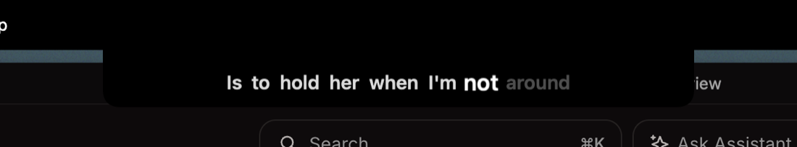
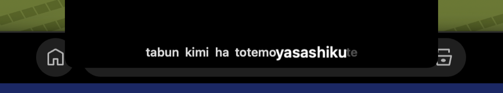

# NotchLyrics

Time-synced lyrics in a click-through overlay under the MacBook notch. Follows
Spotify and Apple Music, romanizes Japanese, Chinese and Korean, and renders
Quran recitation in the mushaf typeface with real per-word timings.

Menu-bar app, no Dock icon, no third-party dependencies.


---

### Spotify



The current line hangs below the notch, with the word being sung enlarged and
fully lit while sung words step back and upcoming words stay dim.

### Japanese, Chinese and Korean



CJK scripts have no spaces, so a naive splitter treats a whole line as one word
and per-word tracking simply does not work — measured at 1.3 words per line
against 6.1 for English. Lines are tokenized properly and romanized, which
brings CJK tracking to ~7.3 words per line.

### Quran recitation


Recitation played through Apple Music is rendered right-to-left in the QCF
mushaf typeface, advancing word by word against **real measured timings** —
not the estimates used for songs.

---

## Requirements

- macOS 14+ (developed and verified on macOS 26.6, Apple Silicon)
- Xcode 26 / Swift 6.3
- Spotify and/or Apple Music

## Install

```bash
./Scripts/build-app.sh release
cp -R NotchLyrics.app /Applications/
open /Applications/NotchLyrics.app
```

macOS will ask for **Automation** permission so the app can read playback state.
Approve it. If you miss the prompt: System Settings → Privacy & Security →
Automation → NotchLyrics.

Enable **Launch at Login** from the menu, or in one shot:

```bash
/Applications/NotchLyrics.app/Contents/MacOS/NotchLyrics --enable-login-item
```

> **Ad-hoc signing caveat.** The Automation grant and the login-item
> registration are both tied to the bundle's code signature, which changes on
> every rebuild. After rebuilding you may need to re-approve Automation and
> re-enable Launch at Login. Signing with a Developer ID makes both stick.

## Menu

| Item | Notes |
|---|---|
| **Re-sync Now** (⌘R) | Resets the clock, re-reads the player, and forgets the cached lyrics for the track so a wrong or missing match is refetched |
| **Position** | Below the Notch (default), Menu Bar Left/Right, Bottom Right |
| **Lyric Style** | Pop Active Word (default) or Fade In Words |
| **Romanize CJK** | Show romaji, or the original script — tracking works either way |
| **NetEase fallback** | Extra coverage, mainly for Asian catalogues |
| **Launch at Login** | |

## How it works

`NotchLyricsCore` is a pure library with no AppKit or SwiftUI import — parsing,
timing, geometry, matching and network logic all live there and are unit-tested.
`NotchLyricsApp` is the thin AppKit/SwiftUI shell.

```
SpotifyBridge ─┐
               ├─> SourceArbiter ─> PlaybackClock ──60 Hz──> OverlayController
MusicBridge ───┘                                                    │
                                                                    ▼
                     QuranProvider → LRCLIB → NetEase        OverlayWindow
                              │                              (NSPanel, all Spaces,
                         LyricsCache                          above the menu bar)
```

Players are polled at 1 Hz — an AppleScript round trip costs ~54 ms warm — and
`PlaybackClock` interpolates between samples against a `ContinuousClock`,
correcting drift without ever running backwards.

### Why not *inside* the notch?

The notch is a physical cutout: there are no pixels behind it. On this machine
it measures 220 × 38 pt, with real display only in the 790 pt "ears" either
side. Anything claiming to draw "in the notch" is drawing directly below it,
which is what this does.

### Timing model

An LRC line's timestamp says when the line *starts*; its end is just the next
line's start, which usually includes dead air after the vocal stops — measured
at 29% of the gap for a median line and 51% at p75. Spreading words across the
whole gap makes emphasis drift progressively behind the vocal.

Instead each line's words are spread over an estimated sung duration,
`min(gap, characters × rate)`, where the rate is measured **per song** from the
20th percentile of gap ÷ characters. Real rates vary about 2× between a fast
pop track and a ballad, so a global constant cannot fit both.

Quran recitation needs none of this: quran.com publishes measured per-word
segments, so those timings are exact rather than inferred.

### Matching

Free lyric databases are inconsistent, and a wrong match is worse than none. A
candidate is rejected unless its declared duration, title and artist all agree
with the track, and CJK lyrics are refused for a track whose own metadata is
entirely Latin.

Results are cached per track. A genuine miss is remembered briefly; a network
failure is not remembered at all, so a moment of bad connectivity cannot blank
a track.

## Lyric sources

| Source | Notes |
|---|---|
| **LRCLIB** | Free, no key, no account. Community-contributed, so coverage varies |
| **NetEase** | Fallback, no auth, stronger Asian-language coverage |
| **quran.com** | Verse text and measured per-word recitation timings |

Coverage is not total. Some tracks have no timed lyrics anywhere, in which case
the overlay stays quiet rather than showing something wrong.

## Tests

```bash
swift test
```

182 tests, no network and no UI: LRC parsing, per-song rate estimation, clock
drift and seek behaviour, source arbitration, CJK segmentation, mushaf-line
assembly, match validation, cache invalidation, and anchor geometry checked
against measured hardware values.

## Docs

Design notes and implementation plans live in `docs/superpowers/`.

## Notes

Personal, local use. Not sandboxed, not notarized. Lyrics come from third-party
community APIs — be considerate with request volume. Screenshots show the app
in use; the songs and recordings belong to their respective rights holders.
